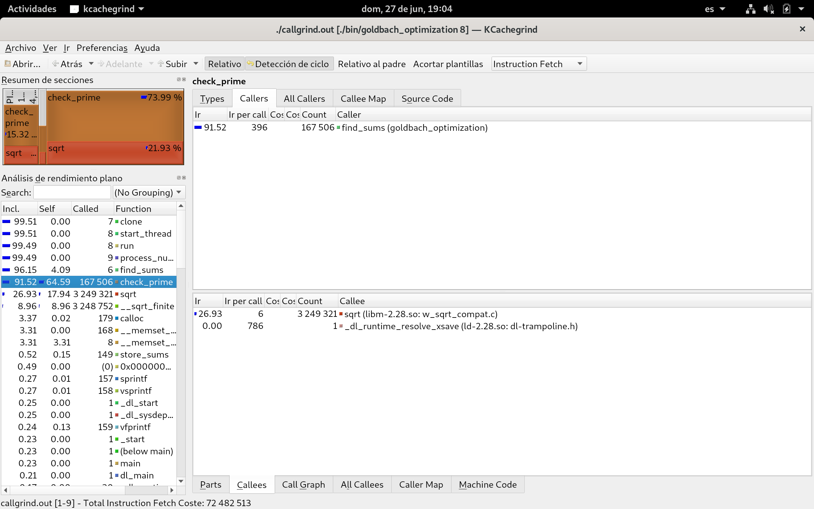
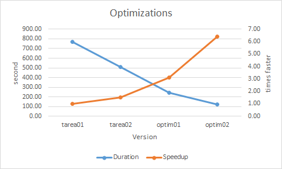
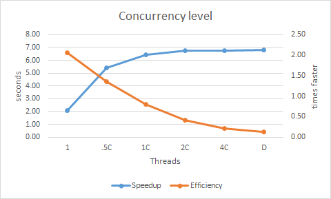
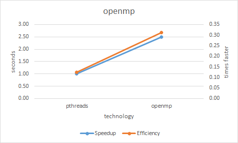
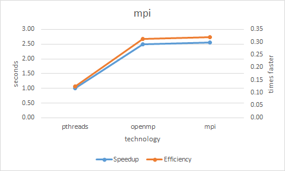

# Documento de reporte
## _goldbach_optimization_
## Adrián Rojas - B96789

Antes de realizar las optimizaciones relacionadas con el mapeo de los hilos, fue necesario optimizar la versión serial para reducir el tiempo de ejecución, con el fin de no tardar tanto realizando las corridas para las pruebas de profiling. Para esto se buscó reducir el número de ciclos realizados a la hora de buscar los números que conforman la suma. La primera versión realizaba una gran cantidad de iteraciones innecesarias, con lo cual se podían eliminar reduciendo el número de iteraciones a más de la mitad.

Tras analizar las estadisticas proporcionadas por la herramienta de profiling Kcachegrind, se determinó que una de las funciones especificas que más demada procesamiento es la funcion sqrt de la libreria math.h. esta funcion se llamaba en check_prime, la cual era una de las funciones mas utilizadas en find_sums, la que a su vez era de las regiones de procesamiento mas demandante en el codigo. El diseño de optimización busca disminuir esta demanda al sustituir la funcion sqrt por un ciclo con menos iteraciones. Ademas se incluyó una mascara para facilitar la deteccion de los numeros primos mas comunes en las sumas, que se encuentran desde el 3 hasta el 61. 

Tras implementar el diseño de optimización se consiguó reducir el tiempo de 245 segundos a 119 segundos. Este incremento se evidencia en el speedup, el cual pasó de 3.13 a 6.41.

## Comparacion de optimizaciones

A pesar de que la version serial tenia una duracion muy elevada, las optimizaciones lograron reducir este tiempo considerablemente. La optimización que tuvo el menor impacto fue el mapeo por cilcos. Aunque este mapeo es le mas facil de implementar, su speedup fue realtivamente bajo. El mapeo por bloque prodría tener una mejora mas destacable con respecto a la duración. Las siguientes optimizaciónes sí lograron un mayor impacto en el rendimiento, reduciendo la duración a la mitad con respecto a su predecesor. La ultima optimizacion en la función check_prime fue la de mayor eficiencia entre las tres. 

En el ultimo grafico se puede apreciar la relacion entre el grado de concurrencia y los tiempos conseguidos. Se puede determinar que entre mas hilos se consigué una menor duración, pero esto tambien le cuesta recursos a la computadora, por lo que se vuelve ineficiente asignarle tantos hilos al programa. Especificamente a partir de los 8 hilos, el speedup es muy similar al de los siguientes grados de concurrencia, y esto se puede ver reflejado en los tiempos de ejecución. Por lo tanto, la cantidad de hilos optima para conseguir el mejor rendimiento sería de 8 hilos, debido a la relación tiempo-eficiencia.

Tras implementar la tecnologia openmp en lugar de los pthreads se obtuvo un mayor rendimiento tanto en el tiempo de ejecucion como eficiencia al utilizar los recursos. Esto puede estar relacionado a que se utilizó una unidad de descomposicion mas granular, ya que anteriormente se habia asignado un numero a cada hilo para que se encargara de procesar las sumas correspondientes. Al utilizar el parallel for fue sencillo asignar una suma a cada hilo creado, con lo cual no se tendria que esperar a que el numero con mas sumas termine para finalizar el programa, si no que entre todos los hilos se dividirian ese trabajo eficientemente. 

Con respecto a la tecnologia mpi no hubo un incremento importante en el rendimiento del programa, pero esto se debe a que se ejecutó con un solo proceso. Esto debido a que a la hora de crear mas de un proceso, estos realizan la lectura del input, por lo que a partir del primero, el resto de procesos quedan esperando a recibir su input. Se intentó limitar la lectura del input a solamente el proceso 0, pero esto resultó en un segmantation fault.  